# Recall goes through the lens: what a model needs from the bridge's mention, across models

*When a model answers a two-step question about an entity, does it need the directions the J++ lens reads at that entity? Does that depend on whether the final fact is recalled or stated, and in which models?*

**Zach Perlman** · MATS 12.0 sprint, Neel Nanda's stream · 19–30 Oct 2026<!-- src: docs/plans/hypotheses.md | The proposal (19 Oct) --><!-- src: docs/depth/README.md | 29 Oct 2026 -->

**Status.** The breadth track of a two-week, two-person sprint, at verification levels 1 to 3: computed from run files, checked by tests, and hand-checked on 46 items ([findings](../review/handcheck_findings.md))<!-- src: docs/review/handcheck_findings.md | 46 items across views a-g -->. No human has recomputed the numbers (level 5 not reached; [VERIFIED.md](../../VERIFIED.md)). Main caveat: the gap measures how much recall needs its answer word's directions, not whether the bridge is used as a step ([Finding 7](#finding-7-what-recall-needs-is-the-answers-own-directions)).

[Root README](../../README.md) · [Depth report](../depth/README.md) · [Hypotheses](../plans/hypotheses.md) · [Pre-registration](prereg_replication_1022.md) · [Examples](../../figures/breadth/examples/README.md) · [Figures](../../figures/breadth/) · [Data](data.csv) · [Reproduce](#reproduce) · Code: [MIT](../../LICENSE) · [Data licences](../../data/SOURCES.md)

## TL;DR

Does a model answering a two-step question need the directions the J++ lens reads at the middle entity, the *bridge*? The final fact is *recalled* from memory or *looked up* in the passage. The *removal* projects out the *lens part*, the lens's top 10 directions, at every token over one mid-depth band. The *recall − lookup gap* is the recall's accuracy drop minus the lookup's.

- **Recall needs a handful of lens-readable directions; reading the same fact does not**. Removing them drops recall {{a|ko.q9.mk}} to {{a|ko.nl.mk}} points more than lookup, on three models from two families → [Finding 1](#finding-1-recall-needs-the-lens-part-reading-the-stated-fact-does-not).
- **What recall needs is its answer's own directions**. Keeping only them undoes {{w|fig10.keep_span.nl}} to {{w|fig10.keep_span.q27}} of the damage → [Finding 7](#finding-7-what-recall-needs-is-the-answers-own-directions). Removals orthogonal to the answer cost nothing (post hoc) → [Finding 8](#finding-8-removals-orthogonal-to-the-answer-cost-nothing-even-for-a-one-hop-question-about-the-subject).
- **At the mention, the lens part carries which entity it is, not its fact**. Taken from one neutral sentence about another entity, it moves the answer as much as from that entity's own passage → [Finding 4](#finding-4-at-the-mention-the-lens-part-carries-which-entity-it-is-not-its-fact).
- **Across models the need is graded**. Of nine models I could test, three show it strongly. The rest are weak, carry the entity without needing it, share it with the logit lens, or show no effect when scored by probability → [the grid](#10-every-model-every-test).
- **For anyone monitoring with a lens**. At the entity's mention the lens shows which entity the model will recall from, in every model. Whether the model depends on those directions is a separate, model-specific question.

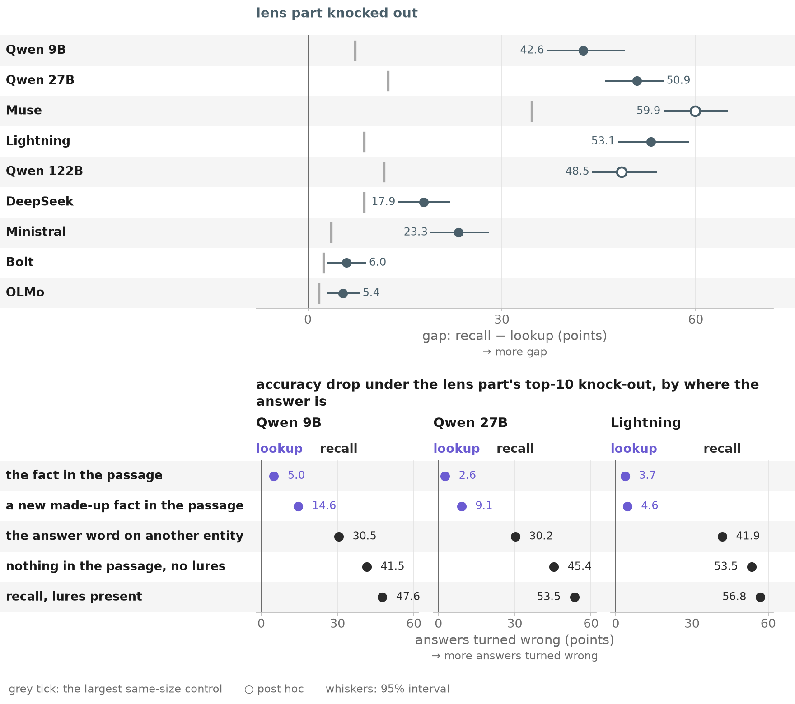

{{caption_short|breadth/readme/01_needed}}

The claims in more detail: models and longer chains

- **Recall needs a handful of lens-readable directions; reading the same fact does not.** In Qwen3.6-27B, Qwen3.5-9B and Nemotron 3.5 Lightning (two families), removing the lens part (the top 10 J++ directions) over one band drops recall accuracy {{a|ko.q27.mk}}, {{a|ko.q9.mk}} and {{a|ko.nl.mk}} points more than the same question with the fact stated, under controls fixed before the run. → [Finding 1](#finding-1-recall-needs-the-lens-part-reading-the-stated-fact-does-not)
- **What recall needs is its answer's own directions.** Keeping only the answer span's directions undoes {{w|fig10.keep_span.nl}} to {{w|fig10.keep_span.q27}} of that damage; removals orthogonal to the answer cost nothing, even on a one-hop question about the subject (the city and answer arms were fixed in advance; the orthogonal arm is post hoc on all three models). → [Finding 7](#finding-7-what-recall-needs-is-the-answers-own-directions), [Finding 8](#finding-8-removals-orthogonal-to-the-answer-cost-nothing-even-for-a-one-hop-question-about-the-subject)
- **At the entity's mention, the lens part carries which entity it is, not its fact.** Taken from one neutral sentence about another entity, it moves the answer as much as when taken from that entity's own passage; a probe that reads the fact there does not carry it. → [Finding 4](#finding-4-at-the-mention-the-lens-part-carries-which-entity-it-is-not-its-fact)
- **Three more models cannot be tested:** any lens removal breaks them. → [the grid](#10-every-model-every-test)
- **Longer chains: the rule "a chain needs the lens part when its last hop is recalled" holds on Lightning, not cleanly on the 27B.** Lightning meets it on every set and on the second seed. On its natural set, less templated passages (generated, with Wikipedia filler), it meets it post hoc. The 27B meets it on three of the four chains ending in a recall, but P → P → M costs only {{vci|mod.q27.threehop.paper10.PPM-PPP}} points beyond the all-passage chain, and M → M → P costs {{vci|mod.q27.threehop.paper10.MMP-PPP}}, which was not predicted. The 9B's chains cannot be read: its all-passage chain alone drops {{v|mod.q9.threehop.paper10.loss.PPP}} points. → [Finding 6](#finding-6-longer-chains-follow-the-rule-cleanly-only-on-lightning-computed-numbers-need-no-lens-part-to-be-reported)

## Setup

Take the question "The composer who wrote The Magic Flute was of which nationality?" Its bridge is Mozart. The passage either states the final fact ("Mozart was Austrian by birth"), which the lookup reads, or leaves it to memory for the recall. Same question, same answer, same passage otherwise.

Real test items, each picked by a fixed rule (`data/figures/examples/data.csv`); captions say how typical each is.

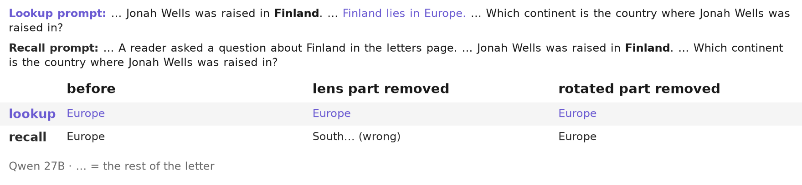

{{caption_short|breadth/examples/01_fact_passage}}

A three-hop example, the five finals and the test split

One entity's three-hop chains (each hop P read or M recalled):

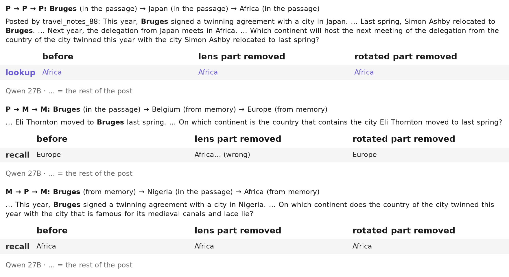

{{caption_short|breadth/examples/02_chains}}

One passage, five finals: the same question with the bridge's fact stated or left to memory.

{{example}}

The test split and, per model, the items it answers right unedited (the items every test runs on):

{{dataset}}

- **Dataset.** jsuite v2: 8 relations; 179 bridge facts on test and a disjoint 171 on dev (dev is used only to choose bands); 15 start × final words; 5,370 test items. An item counts only if the model gets every part of it right unedited.

### Key terms

- **Bridge.** Read from the passage (**P**), tracked through it (**T**), or described, and so recalled (**M**). Each hop of a three-hop chain is P or M.
- **Finals.** The fact left to **memory** (**M**, the recall) or **stated** (**K**, the lookup). Controls: a new made-up fact stated (**P**), the answer word once on another entity (**A**), nothing stated (**N**).
- **Lens part.** At each layer, the 10 directions the J++ lens reads most there. The root README calls the removal the knock-out.
- **Controls of the same size.** The removal rotated to random directions, the logit lens's own top directions, and the residual's top principal directions at the same norm.
- **Swap and transfer.** The swap writes another entity's lens part into the bridge's last token. **Transfer** is the share answering the other entity's fact minus that answering a third's.
- **Datasets.** jsuite v2 is the dataset of record. Earlier sets are toy puzzles, natural fact chains and natplus, less templated passages (generated, with Wikipedia filler), and jsuite v1. The twin set describes people instead of naming them.
- **Post hoc (○).** Chosen after seeing results; the rest is fixed in advance in the [pre-registration](prereg_replication_1022.md) (amendments 1-57).

### Reading the figures

Colours, marks and intervals

Each colour is a role: recall black, lookup violet, the lens part teal, a gap slate, a control grey. Hollow marks (○) are post hoc; a dashed line is a bar fixed in advance. Brackets: 95% bootstrap over bridges.

## Part I. The split

### Finding 1. Recall needs the lens part; reading the stated fact does not

Removing the lens part costs recalled answers {{a|ko.q9.mk}} to {{a|ko.nl.mk}} points more than looked-up ones on the 9B, the 27B and Lightning ([figure above](#tldr)). Same-size removals along other directions cost far less, and scoring by probability keeps the gap. The strongest mundane reading is that the removal takes the answer word's own directions; [Finding 7](#finding-7-what-recall-needs-is-the-answers-own-directions) shows it does. So recall needs these directions, and reading the same fact does not.

Test, results, controls and limits

- **Test.** The removal on jsuite v2's test split, at each model's band, on the items the model answers right unedited. Fixed in advance (amendments 33, 39, 42, 48).
- **Result.** Points, except the principal directions' row (a share of the effect).

  | | 27B | 9B | Lightning |
  |---|---|---|---|
  | recall − lookup gap | {{vci|ko.q27.mk}} | {{vci|ko.q9.mk}} | {{vci|ko.nl.mk}} |
  | stated facts' own drop | {{v|ko.q27.klost}} | {{v|ko.q9.klost}} | {{v|ko.nl.klost}} |
  | the gap scored by the answer's probability | {{v|ko.q27.soft}} | {{v|ko.q9.soft}} | {{v|ko.nl.soft}} |
  | control: the removal rotated | {{v|ko.q27.rot}} | {{v|ko.q9.rot}} | {{v|ko.nl.rot}} |
  | control: the logit lens's own directions | {{v|ko.q27.u}} | {{v|ko.q9.u}} | {{v|ko.nl.u}} |
  | control: top principal directions, same norm (share of the effect) | {{v|ko.q27.pcr}} | {{v|ko.q9.pcr}} | {{v|ko.nl.pcr}} |

  The drop tracks where the answer is. Accuracy drop (points) on the 27B, by final:

  | Final | Drop |
  |---|---|
  | Fact stated (K) | {{v|ko.q27.lostK}} |
  | New made-up fact stated (P) | {{v|ko.q27.lostP}} |
  | Answer word once, on another entity (A) | {{v|ko.q27.lostA}} |
  | Nothing stated, no lures (N) | {{v|ko.q27.lostN}} |
  | Recall (M) | {{v|ko.q27.lostM}} |

  Under the removal, the models rarely name the bridge: {{v|gen.q27.PM.bridge}} (27B), {{v|gen.q9.PM.bridge}} (9B) and {{v|gen.nl.PM.bridge}} (Lightning) of replies. They still know which entity it is, but not its fact.
- **Controls.** Each is the same size as the lens part: the removal rotated to random directions, the logit lens's own top directions, and the residual's top principal directions at the same norm. All three cost far less than the lens part (table).
- **Scope.** The other six models are in [the grid](#10-every-model-every-test). All six fail to show it cleanly:
  - DeepSeek and Ministral are weak ({{v|ko.ds.mk}}, {{v|ko.mi.mk}}); more directions do not rescue DeepSeek ([Finding 5](#finding-5-more-directions-add-damage-that-is-not-specific-bolt-and-deepseek-are-weak-not-spread-out));
  - Bolt shows little: {{v|ko.nb.mk}} at 10 directions, and at 100 a same-size removal along the top principal directions costs nearly as much as the lens part ({{v|dose.nb.k100.pc}} vs {{v|dose.nb.k100}});
  - OLMo does not need it ({{v|ko.ol.mk}});
  - Muse shares more than half of it with the logit lens ({{v|ko.mu.u}} of {{v|ko.mu.mk}});
  - the 122B shows none by probability ({{v|ko.q122.soft}} vs {{v|ko.q122.mk}}).
- **Confidence.** Set by the authors in [docs/plans/credences.md](../plans/credences.md), rows `main_split` and `broadly`.
- **Limits.** The removal also costs plain text; this and the other limits are under [Where it does not hold](#where-it-does-not-hold).

### Finding 2. The split is not one dataset, relation, rendering or checkout

On the two Qwens the gap holds on every dataset I built, every relation, every start, both test halves and three renderings. A clean checkout reproduces their removals row for row. Keeping the bridge's own-word directions restores only a part of the gap, so the need is not just that word. The split is a property of the models, not of one set.

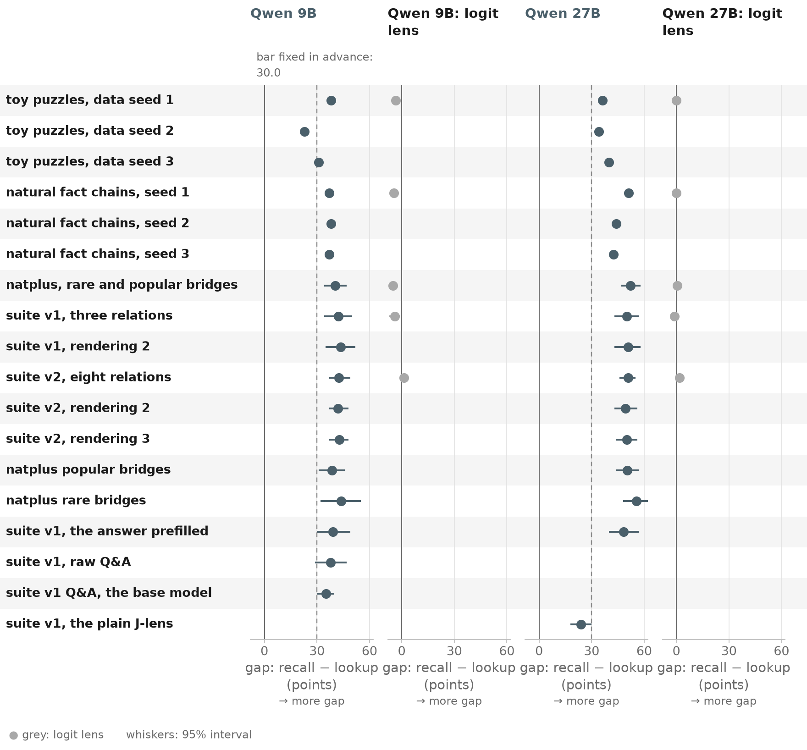

{{caption_short|breadth/readme/02_datasets}}

Test, results, controls and limits

- **Test.** The same removal on every dataset I built, every relation, start, test half and rendering; a rerun from a clean checkout; the removal with the bridge's own-word directions kept. Fixed in advance (amendments 6, 11, 14, 20, 23, 29, 33, 35, 38, 50, 55, 56).
- **Result: every dataset I built since day 1 (the two Qwens).** Each dataset has its own contrast: memory-final minus prompt-final words on the earlier sets, M − P on v1.

  | Dataset | 27B | 9B |
  |---|---|---|
  | Toy puzzles, data seeds 1 / 2 / 3 | {{v|toy.q27.s1}} / {{v|toy.q27.s2}} / {{v|toy.q27.s3}} | {{v|toy.q9.s1}} / {{v|toy.q9.s2}} / {{v|toy.q9.s3}} |
  | Natural fact chains, seeds 1 / 2 / 3 | {{v|nat.q27.s1}} / {{v|nat.q27.s2}} / {{v|nat.q27.s3}} | {{v|nat.q9.s1}} / {{v|nat.q9.s2}} / {{v|nat.q9.s3}} |
  | natplus | {{vci|natplus.q27}} | {{vci|natplus.q9}} |
  | jsuite v1 | {{vci|v1.q27}} | {{vci|v1.q9}} |

- **Controls.** The logit lens's own directions, the same size, stay near zero wherever they were run:

  | Logit lens on | 27B | 9B |
  |---|---|---|
  | Toy puzzles | {{v|toy.q27.u}} | {{v|toy.q9.u}} |
  | Natural fact chains | {{v|nat.q27.u}} | {{v|nat.q9.u}} |
  | natplus | {{v|natplus.q27.u}} | {{v|natplus.q9.u}} |
  | jsuite v1 | {{v|v1.q27.u}} | {{v|v1.q9.u}} |

- **Lightning on natplus** (amendment 55): {{vci|natplus.nl}}, with rotated {{v|natplus.nl.rot}} and logit lens {{v|natplus.nl.u}}. Its only other datasets are v2 and the natural three-hop set ([Finding 6](#finding-6-longer-chains-follow-the-rule-cleanly-only-on-lightning-computed-numbers-need-no-lens-part-to-be-reported)).

The other models on the datasets they ran:

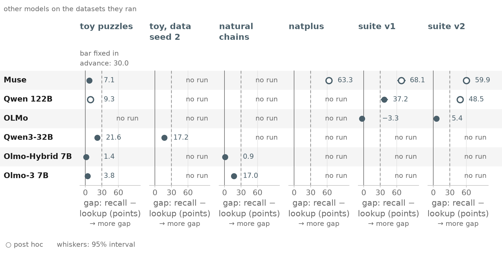

{{caption_short|breadth/readme/02b_datasets}}

- **Every relation.**
  - On the 27B, the gap runs from {{v|ko.q27.rel.languages}} (languages) to {{v|ko.q27.rel.dishes}} (dishes).
  - Animals is the weakest everywhere (6 answers): 9B {{vci|ko.q9.rel.animals}}, Lightning {{vci|ko.nl.rel.animals}}.

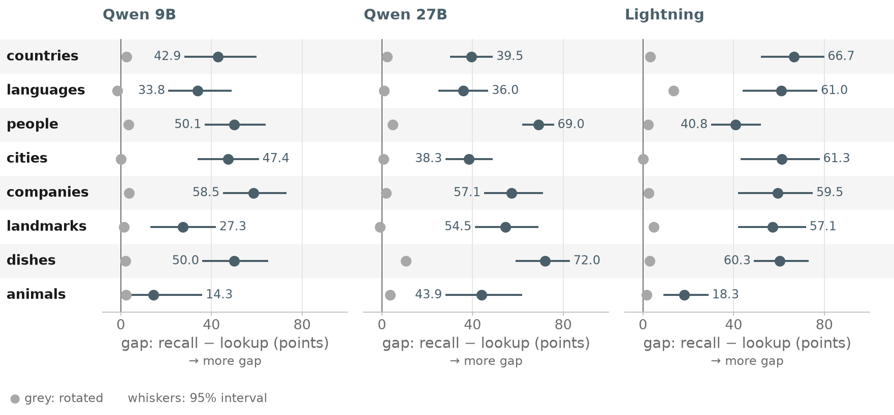

{{caption_short|breadth/readme/03a_robust}}

- **Every start, both test halves, three renderings.**
  - Renderings: 27B {{v|ko.q27.r2}} and {{v|ko.q27.r3}}; 9B {{v|ko.q9.r2}} and {{v|ko.q9.r3}}; Lightning {{v|ko.nl.r2}} and {{v|ko.nl.r3}}.
  - A rendering redraws passages, distractors and wording over the same facts.

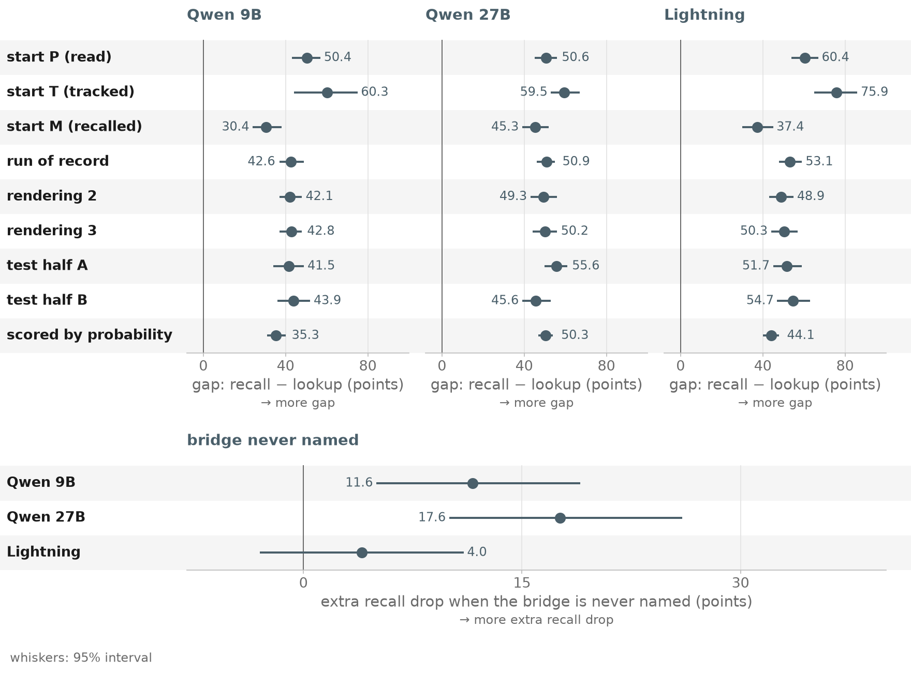

{{caption_short|breadth/readme/03b_robust}}

- **A clean checkout reproduces it.** Rerun from a fresh worktree:
  - the 27B's and 9B's removals match row for row ({{v|clean.q27.diff}} of {{v|clean.q27.rows}} and {{v|clean.q9.diff}} of {{v|clean.q9.rows}} rows differ);
  - Lightning's headline reproduces ({{vci|clean.nl.mk_rerun}} vs {{vci|ko.nl.mk}}) but not row for row: {{v|clean.nl.diff}} of {{v|clean.nl.rows}} rows differ.
  - Lightning is deterministic: rerun at HEAD with the clean rerun's eligibility and batch size, it matches the clean rerun on {{v|det.nl.same}} of {{v|det.nl.rows}} rows (amendment 56).
  - So the differences come from inputs, not kernels: the clean competence rerun covered more prompts, which changed a few items' eligibility and which prompts shared a batch. Code changes since the record run are not ruled out.
- **It is not the bridge's own word (the plan's kill test).** Keeping the bridge's own-word directions restores only:

  | | Share restored |
  |---|---|
  | 27B (v2) | {{v|keepown.q27}} |
  | 9B (v2) | {{v|keepown.q9}} |
  | Lightning (v2) | {{v|keepown.nl}} |
  | Ministral (v2) | {{v|keepown.mi}} |
  | 27B (toy suite) | {{v|keepown.toy.q27}} |
  | 9B (toy suite) | {{v|keepown.toy.q9}} |

  The kill bar is 0.75.
- **Rare bridges drop as much as popular ones**, so Neel's narrow-concept prediction is not supported. natplus, popular vs rare: 27B {{v|natplus.q27.pop}} vs {{v|natplus.q27.rare}}; 9B {{v|natplus.q9.pop}} vs {{v|natplus.q9.rare}}; Lightning {{v|natplus.nl.pop}} vs {{v|natplus.nl.rare}}.
- **It is mostly from pretraining.** The 9B base model gives {{v|v1.q9base.qa}} against the instruct model's {{v|v1.q9inst.qa}} (same Q&A format, same lens).
- **The lens matters; who fitted it does not.**
  - On the 27B (v1), the plain J-lens finds {{v|v1.q27.jlens}} against the J++ lens's {{v|v1.q27}}.
  - The Qwens use published J++ lenses; the other models use the project's own fits. On the 9B, the project's own fit gives {{vci|ko.q9oj.mk}} against the published lens's {{vci|ko.q9.mk}}.
- **A bridge never named.** Deleting the bridge's one passing mention adds to the recall's drop: {{vci|r.q27}} (27B), {{vci|r.q9}} (9B) and {{vci|r.nl}} (Lightning).
- **Scope.** Datasets and relations on the two Qwens; Lightning on v2, natplus and the natural three-hop set; the other models in the figure above.
- **Confidence.** Not set by the authors for this claim.
- **Limits.** The earlier datasets measure their own contrast, not the recall − lookup gap (first table); Lightning's clean rerun differs row by row (above).

### Finding 3. The need sits at the bridge's mention at mid depth and in the question late

In the Qwens a read bridge needs the lens part at its own mention at mid depth; Lightning needs it at the mention and the question. Late in depth the need moves to the question in both families. A monitor reading one position at one layer sees only part of what the recall uses.

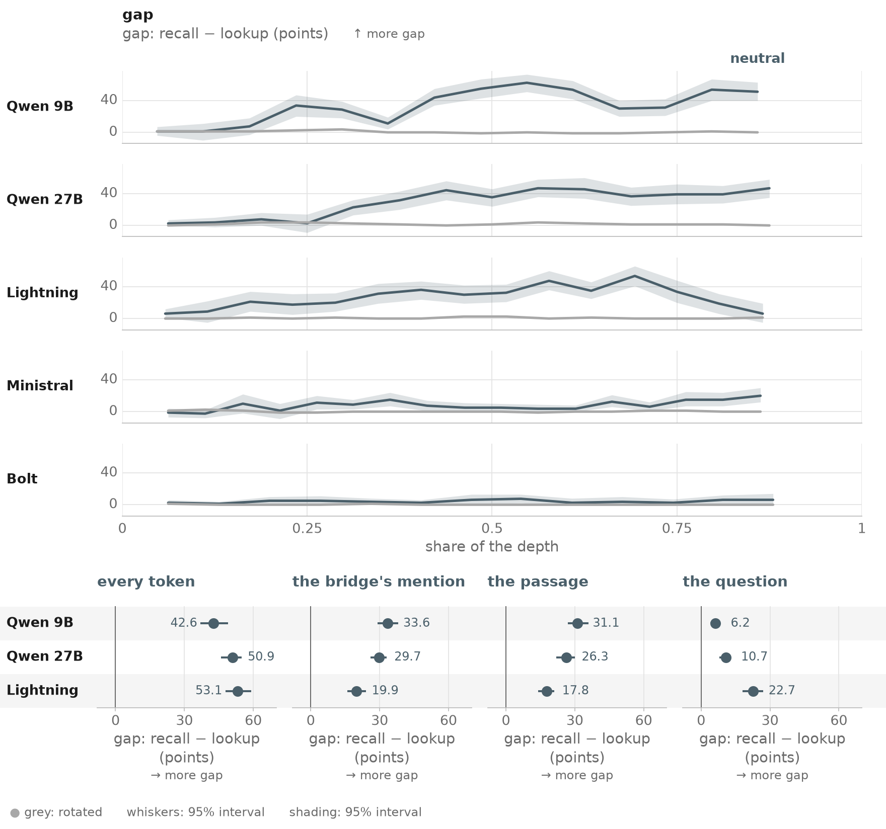

{{caption_short|breadth/readme/04_where}}

Test, results, controls and limits

- **Test.** The removal by sliding window of layers, and restricted to the bridge's mention, the passage or the question. Fixed in advance (amendments 30, 36, 37); Lightning's and Bolt's split in amendment 54; the 9B's and Lightning's late bands in amendment 57.
- **Result.**
  - **In the Qwens, a read bridge needs the directions at its own mention.** Mention alone: {{v|pos.q27.P.bridge}} of {{v|pos.q27.P.all}} (27B) and {{v|pos.q9.P.bridge}} of {{v|pos.q9.P.all}} (9B). Question alone: {{v|pos.q27.P.question}} and {{v|pos.q9.P.question}}.
  - **Lightning needs them at both the mention and the question.** Mention {{v|pos.nl.P.bridge}} and question {{v|pos.nl.P.question}}, of {{v|pos.nl.P.all}}. Its lookup happens inside its band ([Finding 4](#finding-4-at-the-mention-the-lens-part-carries-which-entity-it-is-not-its-fact)); the Qwens' happens after theirs.
  - **Bolt splits the same way as Lightning**, with 100 directions: mention {{v|pos.nb.bridge}} and question {{v|pos.nb.question}}, of {{v|dose.nb.k100}}. The two Nemotrons split; the Qwens' read bridges sit at the mention.
  - **A recalled bridge needs them at several places at once.** No single region carries it: on the 27B, mention {{v|pos.q27.M.bridge}} and question {{v|pos.q27.M.question}}, of {{v|pos.q27.M.all}}.
  - **Late in depth, the dependence moves to the question, in both families.** The recall − lookup gap, all starts:

  | Model (late band, depth) | All tokens | Question only | Mention only |
  |---|---|---|---|
  | 27B (L52-60, 81-94%) | {{v|late.q27.all}} | {{v|late.q27.question}} | {{v|late.q27.bridge}} |
  | 9B (L26-29, 81-91%) | {{v|late.q9.all}} | {{v|late.q9.question}} | {{v|late.q9.bridge}} |
  | Lightning (L33-39, 64-75%) | {{v|late.nl.all}} | {{v|late.nl.question}} | {{v|late.nl.bridge}} |
  | Ministral (L32-37) | {{v|ko.mi.mk}} | {{v|pos.mi.question}} | {{v|pos.mi.bridge}} |
  | 122B (L39-45) | {{v|ko.q122.mk}} | {{v|pos.q122.question}} | {{v|pos.q122.bridge}} |
  | Muse (L36-42) | {{v|ko.mu.mk}} | {{v|pos.mu.question}} | {{v|pos.mu.bridge}} |

- **Controls.** The rotated removal of the same size at each window (the figure's grey).
- **Scope.** Positions on the 27B, the 9B, Lightning and Bolt; late bands on the six models of the table.
- **Confidence.** Not set by the authors for this claim.
- **Limits.**
  - The 9B's and Lightning's late bands were picked on dev (amendment 57): the latest window where stated facts still drop at most 10. Lightning's is shallower than the 27B's because past 69% depth its removal breaks stated facts too.
  - At these bands more of the effect is shared with the logit lens: 9B {{v|late.q9.all.u}}, Lightning {{v|late.nl.all.u}} (mid band: {{v|ko.q9.u}}, {{v|ko.nl.u}}).

## Part II. What the lens part carries

### Finding 4. At the mention, the lens part carries which entity it is, not its fact

Another entity's lens part, swapped into the bridge, moves the answer to that entity's fact (transfer {{v|swap.nl.swap}} to {{v|swap.q9.swap}} points). From one neutral sentence about that entity it moves the answer as much as from its own passage. Dropping the answer's direction leaves the swap unchanged, so it is not the answer token. At the mention the lens part is a reference to the entity; the fact is looked up later.

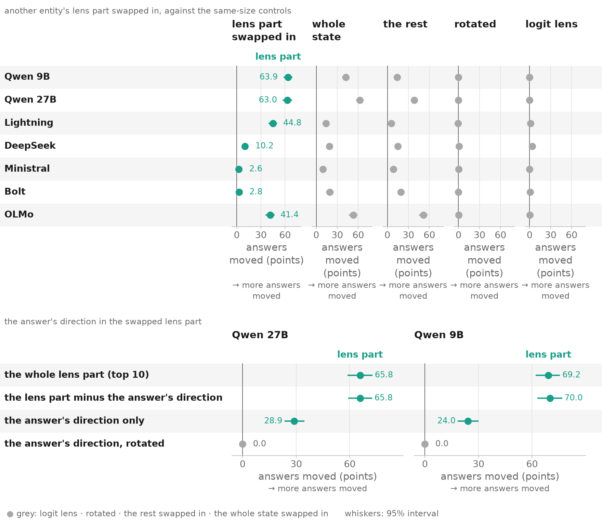

{{caption_short|breadth/readme/05_carries}}

Test, results, controls and limits

- **Test.** Swap another entity's lens part into the bridge's last token, taken from its own passage, from one neutral sentence about it, or from a passage on another relation. Swap a supervised probe's subspace instead. Read the answer position layer by layer. Fixed in advance (amendments 32, 34, 38A, 47, 48, 51, 55 note 1).
- **Result.**
  - **The answer follows a swapped lens part.** Transfer: {{vci|swap.q27.swap}} (27B), {{vci|swap.q9.swap}} (9B), {{vci|swap.nl.swap}} (Lightning). Pasting the whole residual moves less in Lightning ({{v|swap.nl.paste}}), because it also overwrites position and binding.
  - **It is a reference to the entity, whatever context it came from.** From one neutral sentence about the other entity, the lens part moves the answer {{v|ptr.q27.neutral}}, {{v|ptr.q9.neutral}} and {{v|ptr.nl.neutral}} times as much as from that entity's own passage. It holds on {{v|ptr.q27.rel_held}} of {{v|ptr.q27.rel_read}} relations on the 27B. Bolt, with 100 directions (amendment 55 note 1): {{v|ptr.nb.neutral}}, on {{v|ptr.nb.rel_held}} of {{v|ptr.nb.rel_read}} relations. From a passage on another relation it moves {{v|xrel.q27}} / {{v|xrel.q9}} / {{v|xrel.nl}} as much.
  - **In the Qwens it is more than the name; in the Nemotrons, less so.** Without the entity's own-word directions, the swap keeps {{v|ptr.q27.noown}} / {{v|ptr.q9.noown}} / {{v|ptr.nl.noown}}. Bolt's keeps {{v|ptr.nb.noown}}, below the 2/3 bar: its reference is mostly the name's own directions.
  - **Decodable is not carried.** A supervised probe reads the fact at the mention about as well as the lens. Swapping the probe's subspace moves {{v|probe.q27.probe}} / {{v|probe.q9.probe}} / {{v|probe.nl.probe}}, against the lens part's {{v|probe.q27.swap}} / {{v|probe.q9.swap}} / {{v|probe.nl.swap}}.

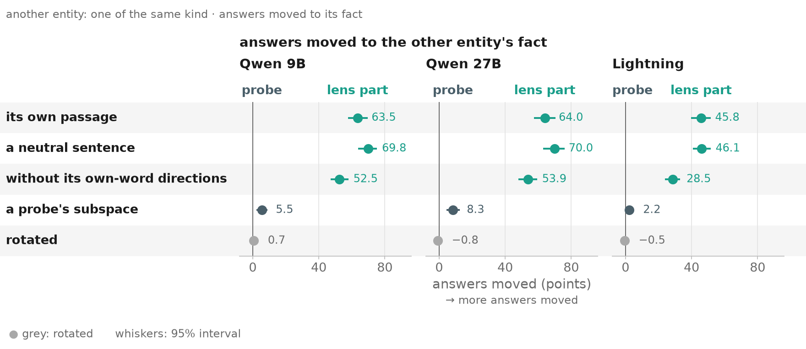

{{caption_short|common/readme/04_pointer}}

- **The fact is looked up later.** At the answer position, the lens first reads X's fact on half the items at layer {{v|ptr.q27.lookup}} on the 27B (band ends at L40), layer {{v|ptr.q9.lookup}} on the 9B (L16) and layer {{v|ptr.nl.lookup}} on Lightning (L33). For a swapped entity it reads the other entity's fact at the same layers.

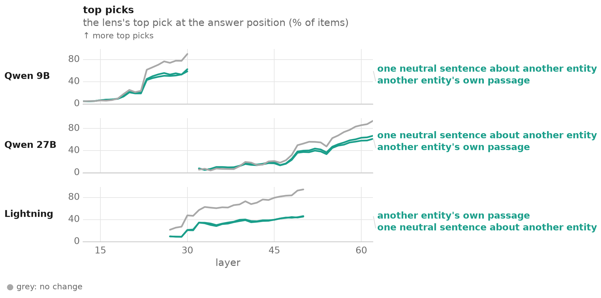

{{caption_short|breadth/readme/07_lookup}}

- **Controls.**
  - Rotated or logit-lens parts of the same size move nothing (27B: {{v|swap.q27.swap_rot}} and {{v|swap.q27.swap_u}}).
  - **It is not just the answer token (Neel's linear answer swap).** Without the other entity's answer direction, the swap is unchanged: {{v|ans.q27.swap_noans}} vs {{v|ans.q27.swap}} (27B) and {{v|ans.q9.swap_noans}} vs {{v|ans.q9.swap}} (9B), on the PM final. The answer direction alone moves {{v|ans.q27.swap_ans}}.
- **Scope: readable, carried and needed come apart.**
  - OLMo carries the entity (swap {{v|swap.ol.swap}}), but the removal costs only {{v|ko.ol.mk}}.
  - Ministral's lens reads the fact at mid depth, but its lens part carries only {{v|swap.mi.mid.swap}}, and {{v|swap.mi.mid.k100.swap}} with 100 directions.

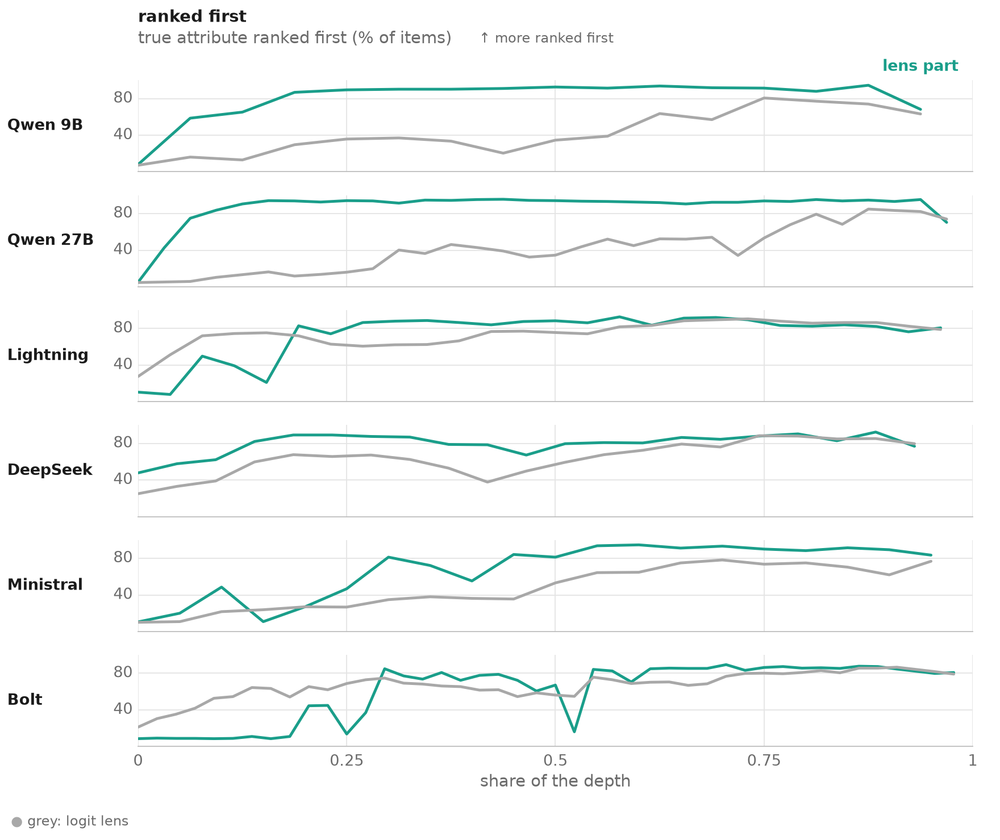

{{caption_short|breadth/readme/08_readable}}

- **Confidence.** Not set for this claim as stated; the nearest the authors set are in [docs/plans/credences.md](../plans/credences.md), rows `associations` and `readable_not_used`.
- **Limits.** Bolt's reference is mostly its name's own directions (above); the general limits are under [Where it does not hold](#where-it-does-not-hold).

### Finding 5. More directions add damage that is not specific; Bolt and DeepSeek are weak, not spread out

In the 9B, Lightning and Ministral most of the lens-specific part sits in the first few directions; the 27B keeps rising to about 30. More directions add damage that is not specific, which greedy answers hide. In Bolt and DeepSeek a same-size removal costs about as much at every number of directions. A fixed number of directions is not a fixed dose.

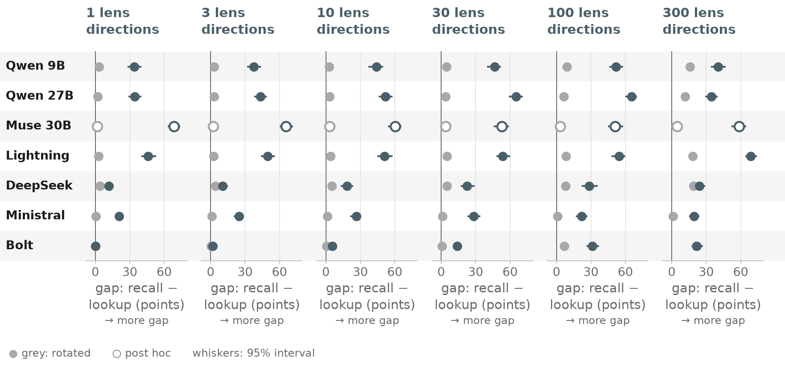

{{caption_short|breadth/readme/09_dose}}

Test, results, controls and limits

- **Test.** The removal with 1 to 100 lens directions, against the same number rotated and the same size along the residual's top principal directions; swaps with more directions. Fixed in advance (amendments 52-55); the excess and probability readings after Lightning's grid, before the others (amendment 54 note 1).
- **Result: the recall − lookup gap at 1, 10 and 100 directions.**

  | Model | 1 | 10 | 100 |
  |---|---|---|---|
  | 27B | {{v|dose.q27.k1}} | {{v|dose.q27.k10}} | {{v|dose.q27.k100}} |
  | 9B | {{v|dose.q9.k1}} | {{v|dose.q9.k10}} | {{v|dose.q9.k100}} |
  | Lightning | {{v|dose.nl.k1}} | {{v|dose.nl.k10}} | {{v|dose.nl.k100}} |
  | Ministral | {{v|dose.mi.k1}} | {{v|dose.mi.k10}} | {{v|dose.mi.k100}} |
  | DeepSeek | {{v|dose.ds.k1}} | {{v|dose.ds.k10}} | {{v|dose.ds.k100}} |
  | Muse | {{v|dose.mu.k1}} | {{v|dose.mu.k10}} | {{v|dose.mu.k100}} |

  The 27B keeps rising to 30 directions ({{v|dose.q27.k30}}). Muse (amendment 57 note 1) is specific at every K: at 10 directions the size-matched control costs {{v|dose.mu.k10.pc}} and the rotated one {{v|dose.mu.k10.rot}}, but the logit lens's own 10 directions cost {{v|dose.mu.k10.u}}.
- **More directions add damage that is not specific.** Greedy answers hide it: the answer given in the passage usually stays on top while its probability drops a lot.
  - Lightning: stated facts drop {{a|dose.nl.k100.K}} points by greedy answer at 100 directions, but {{a|dose.nl.k100.sK}} by probability.
  - The plateau rule as pre-registered calls Lightning distributed (K\* {{v|dose.nl.kstar}}). On the lens-specific excess it is concentrated (K\* {{v|dose.nl.ekstar}}).
- **Controls: Bolt is weak, not spread out.** Its lens-part effect grows with the number of directions, but a removal of the same size along the residual's top principal directions costs about as much:

  | Directions | Lens part | Same size, top principal directions |
  |---|---|---|
  | 10 | {{v|dose.nb.k10}} | {{v|dose.nb.k10.pc}} |
  | 30 | {{v|dose.nb.k30}} | {{v|dose.nb.k30.pc}} |
  | 100 | {{v|dose.nb.k100}} | {{v|dose.nb.k100.pc}} |

  - By probability, the lens part keeps an edge only at 100 directions: {{v|dose.nb.k100.smk}} vs {{v|dose.nb.k100.spc}}.
  - Bolt's 100 directions remove {{v|dose.nb.k100.share}} of the residual. Lightning's top 10 remove about the same ({{v|dose.nl.k10.share}}) and give {{v|dose.nl.k10}}.
  - The pre-registered limit stops Bolt's readings at K {{v|dose.nb.limit}}, where the size-matched control already exceeds half the lens part's effect; below it the effect is about 0 ({{v|dose.nb.k3}} at 3).
  - Its lens part swap still carries the entity at 100 directions, as a context-free reference to the entity ([Finding 4](#finding-4-at-the-mention-the-lens-part-carries-which-entity-it-is-not-its-fact)). Bolt's mention holds the entity in J-space, but its recall does not depend on those directions more than on any same-size removal.

- **Controls: DeepSeek is weak at every dose, not under-dosed** (amendment 56):

  | Directions | Lens part | Same size, top principal directions | Rotated |
  |---|---|---|---|
  | 10 | {{v|dose.ds.k10}} | {{v|dose.ds.k10.pc}} | {{v|dose.ds.k10.rot}} |
  | 30 | {{v|dose.ds.k30}} | {{v|dose.ds.k30.pc}} | {{v|dose.ds.k30.rot}} |
  | 100 | {{v|dose.ds.k100}} | {{v|dose.ds.k100.pc}} | {{v|dose.ds.k100.rot}} |

  - The pre-registered limit stops it at K {{v|dose.ds.limit}}; its lens-specific excess peaks at 1 direction ({{v|dose.ds.k1.exc}}).
  - Its top direction alone removes {{v|dose.ds.k1.share}} of the residual; all 100 remove {{v|dose.ds.k100.share}}.
  - At 100 directions stated facts drop {{a|dose.ds.k100.K}} points.
- **Scope: swapping more directions.**
  - The 9B's swap grows: {{v|swapk.q9.k10}} → {{v|swapk.q9.k100}}.
  - The 27B's and Lightning's are saturated (under the +10 bar): {{v|swapk.q27.k10}} → {{v|swapk.q27.k100}} and {{v|swapk.nl.k10}} → {{v|swapk.nl.k100}}.
  - Bolt's carries only at 100: {{v|swapk.nb.k10}} → {{v|swapk.nb.k100}}.
  - Ministral's never carries (at mid depth, L20-25): {{v|swapk.mi.k10}} → {{v|swapk.mi.k100}}.
- **Confidence.** Not set by the authors for this claim.
- **Limits.** The plateau rule as pre-registered judged greedy answers, and the dose runs use fewer items per word; both are under [Where it does not hold](#where-it-does-not-hold).

## Part III. Beyond two hops

### Finding 6. Longer chains follow the rule cleanly only on Lightning; computed numbers need no lens part to be reported

The rule "a chain needs the lens part when its last hop is recalled" holds on Lightning on every set and seed. The 27B misses it on P → P → M and adds an unpredicted M → M → P; the 9B's chains cannot be read. Reporting a number computed from the passage by arithmetic costs nothing in all three models. One model meeting the chain rule cleanly is not enough for a general rule.

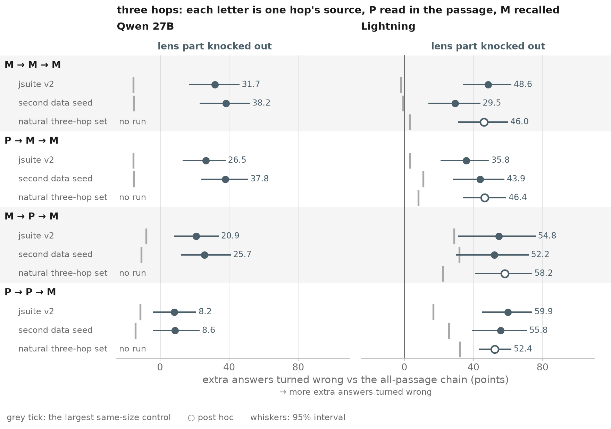

{{caption_short|breadth/readme/10a1_beyond}}

Test, results, controls and limits

- **Test.** Does the rule hold for longer chains, and for intermediates the model computes from the passage? This is the proposal's own question ([H0](../plans/hypotheses.md#h0-deflationary-failed-for-recalled-entities-held-in-part-for-computed-numbers): J-space carries recalled words, not computed variables). Fixed in advance (amendments 21, 24, 25 on the earlier dataset; 56 on v2 and Lightning; 57 on a second seed and a larger numbers set).
- **Result: three-hop chains.** Accuracy drop (points) beyond the all-passage chain (P → P → P); each letter is one hop's source. The second seed is jsuite_v2nb (amendment 57: new chains, same design):

  | Chain | 27B (v2) | 27B (second seed) | Lightning (v2) | Lightning (second seed) | Lightning (natural set) |
  |---|---|---|---|---|---|
  | M → M → M | {{vci|mod.q27.threehop.paper10.MMM-PPP}} | {{vci|mod2.q27.threehop.paper10.MMM-PPP}} | {{vci|mod.nl.threehop.paper10.MMM-PPP}} | {{vci|mod2.nl.threehop.paper10.MMM-PPP}} | {{vci|nat3.nl.paper10.MMM}} |
  | P → M → M | {{vci|mod.q27.threehop.paper10.PMM-PPP}} | {{vci|mod2.q27.threehop.paper10.PMM-PPP}} | {{vci|mod.nl.threehop.paper10.PMM-PPP}} | {{vci|mod2.nl.threehop.paper10.PMM-PPP}} | {{vci|nat3.nl.paper10.PMM}} |
  | M → P → M | {{vci|mod.q27.threehop.paper10.MPM-PPP}} | {{vci|mod2.q27.threehop.paper10.MPM-PPP}} | {{vci|mod.nl.threehop.paper10.MPM-PPP}} | {{vci|mod2.nl.threehop.paper10.MPM-PPP}} | {{vci|nat3.nl.paper10.MPM}} |
  | P → P → M | {{vci|mod.q27.threehop.paper10.PPM-PPP}} | {{vci|mod2.q27.threehop.paper10.PPM-PPP}} | {{vci|mod.nl.threehop.paper10.PPM-PPP}} | {{vci|mod2.nl.threehop.paper10.PPM-PPP}} | {{vci|nat3.nl.paper10.PPM}} |
  | M → M → P | {{vci|mod.q27.threehop.paper10.MMP-PPP}} | {{vci|mod2.q27.threehop.paper10.MMP-PPP}} | {{vci|mod.nl.threehop.paper10.MMP-PPP}} | {{vci|mod2.nl.threehop.paper10.MMP-PPP}} | {{vci|nat3.nl.paper10.MMP}} |
  | M → P → P | {{vci|mod.q27.threehop.paper10.MPP-PPP}} | {{vci|mod2.q27.threehop.paper10.MPP-PPP}} | {{vci|mod.nl.threehop.paper10.MPP-PPP}} | {{vci|mod2.nl.threehop.paper10.MPP-PPP}} | {{vci|nat3.nl.paper10.MPP}} |
  | P → M → P | {{vci|mod.q27.threehop.paper10.PMP-PPP}} | {{vci|mod2.q27.threehop.paper10.PMP-PPP}} | {{vci|mod.nl.threehop.paper10.PMP-PPP}} | {{vci|mod2.nl.threehop.paper10.PMP-PPP}} | {{vci|nat3.nl.paper10.PMP}} |

  - **Pre-registered:** the four chains ending in a recall drop more than P → P → P; M → P → P and P → M → P do not. Lightning meets all of it, on v2, on the second seed and on the natural set (post hoc). The 27B meets it except P → P → M, on both seeds ({{vci|mod.q27.threehop.paper10.PPM-PPP}} and {{vci|mod2.q27.threehop.paper10.PPM-PPP}}).
  - **Not predicted:** the 27B's M → M → P also drops; Lightning's does not.
  - **The 9B cannot be read.** Its all-passage chain alone drops {{v|mod.q9.threehop.paper10.loss.PPP}} points (rotated {{v|mod.q9.threehop.paper10_rot.loss.PPP}}; n {{n|mod.q9.threehop.paper10.loss.PPP}}).
  - **The earlier dataset agrees** (27B, v1): M → M → M {{vci|hop3.q27.MMM}} and P → M → M {{vci|hop3.q27.PMM}}; M → P → P {{v|hop3.q27.MPP}} and P → M → P {{v|hop3.q27.PMP}}.
- **Controls of the chains.**
  - On the 27B, the rotated and logit-lens removals cost no chain more than P → P → P. P → P → P itself drops {{v|mod.q27.threehop.paper10.loss.PPP}} points under the lens part and {{v|mod.q27.threehop.paper10_rot.loss.PPP}} rotated, so only the excess is read.
  - In Lightning the controls explain part of two cells, on every set. M → P → M: rotated {{v|mod.nl.threehop.paper10_rot.MPM-PPP}} and logit lens {{v|mod.nl.threehop.unembed10.MPM-PPP}} on v2 (n {{n|mod.nl.threehop.paper10.loss.MPM}}), {{v|mod2.nl.threehop.paper10_rot.MPM-PPP}} and {{v|mod2.nl.threehop.unembed10.MPM-PPP}} on the second seed (n {{n|mod2.nl.threehop.paper10.loss.MPM}}). P → P → M: logit lens {{v|nat3.nl.unembed10.PPM}} on the natural set, {{v|mod2.nl.threehop.unembed10.PPM-PPP}} on the second seed.

Chains whose last hop reads the passage, the same way:

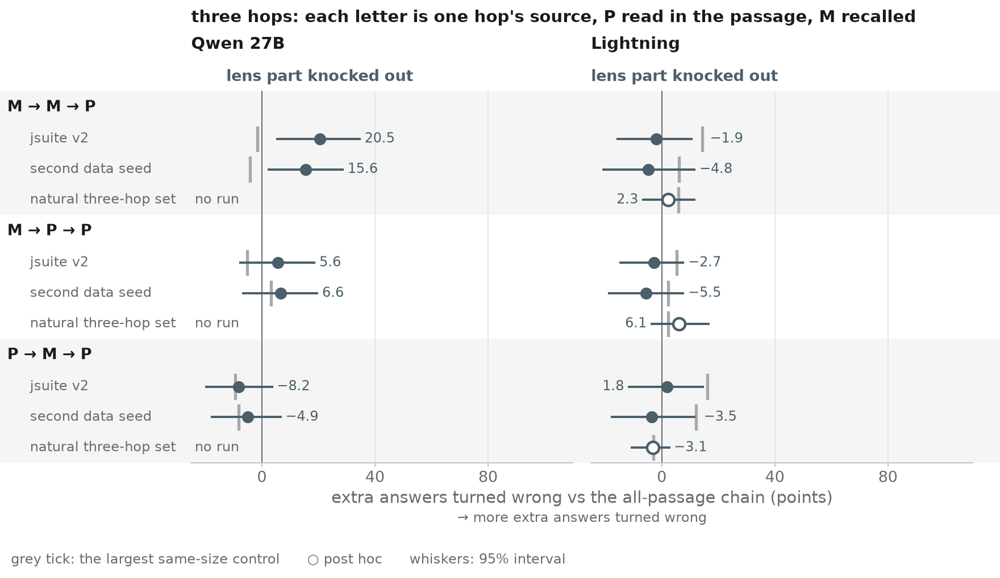

{{caption_short|breadth/readme/10a2_beyond}}

- **Result: a number computed from the passage does not need the lens part to be reported.** Accuracy drop (points) reporting the number, minus a number read from the passage (digit tokens included in the removal):

  | The number is | 27B | 9B | Lightning |
  |---|---|---|---|
  | Counted from a list | {{vci|mod.q27.numbers.paper10.KR-PR}} | {{vci|mod.q9.numbers.paper10.KR-PR}} | {{vci|mod.nl.numbers.paper10.KR-PR}} |
  | Computed by adding or subtracting | {{vci|mod.q27.numbers.paper10.AR-PR}} | {{vci|mod.q9.numbers.paper10.AR-PR}} | {{vci|mod.nl.numbers.paper10.AR-PR}} |
  | Recalled | {{vci|mod.q27.numbers.paper10.MR-PR}} | {{vci|mod.q9.numbers.paper10.MR-PR}} | {{vci|mod.nl.numbers.paper10.MR-PR}} |

  - **Pre-registered:** counted and computed within 10 of read; recalled at least 10 above.
    - The Qwens meet all three.
    - Lightning misses two: counting costs it {{v|mod.nl.numbers.paper10.KR-PR}}, and reporting a recalled number only {{v|mod.nl.numbers.paper10.MR-PR}}.
    - Rotated and logit-lens controls cost recalled numbers nothing ({{v|mod.q27.numbers.paper10_rot.MR-PR}} in every model).
  - **A recalled number feeding another recall needs the lens part no more than one feeding a lookup.** On the larger set (amendment 57; n {{n|mod2.q9.numbers.paper10.loss.ML}} to {{n|mod2.q27.numbers.paper10.loss.ML}} per word), the month or planet at that position minus the locker with that number: 27B {{vci|mod2.q27.numbers.paper10.MM-ML}}, 9B {{vci|mod2.q9.numbers.paper10.MM-ML}}, Lightning {{vci|mod2.nl.numbers.paper10.MM-ML}}.
    - Amendment 24's final-hop rule for numbers (each start's recall final >= 20 above its lookup final) fails for every start in all three models.
    - On v2, Lightning's +47 (n {{n|mod.nl.numbers.paper10.loss.MM}} and {{n|mod.nl.numbers.paper10.loss.ML}}) looked like the rule; at ten times the items it does not replicate.
  - **The earlier dataset agrees** (v1): 9B counted {{v|num.q9.KR-PR}}, computed {{v|num.q9.AR-PR}}, recalled {{vci|num.q9.MR-PR}}; 27B recalled {{v|num.q27.MR-PR}}.
- **Result: does a number computed from the passage need the lens part when it keys a recall ([H0](../plans/hypotheses.md#h0-deflationary-failed-for-recalled-entities-held-in-part-for-computed-numbers) head-on)?** Accuracy drop (points), minus the same recall keyed by a number read from the passage (larger set, amendment 57):

  | | 27B | 9B | Lightning |
  |---|---|---|---|
  | Counted, then recalled | {{vci|mod2.q27.numbers.paper10.KM-PM}} | {{vci|mod2.q9.numbers.paper10.KM-PM}} | {{vci|mod2.nl.numbers.paper10.KM-PM}} |
  | Computed, then recalled | {{vci|mod2.q27.numbers.paper10.AM-PM}} | {{vci|mod2.q9.numbers.paper10.AM-PM}} | {{vci|mod2.nl.numbers.paper10.AM-PM}} |
  | Counted / computed, rotated removal | {{v|mod2.q27.numbers.paper10_rot.KM-PM}} / {{v|mod2.q27.numbers.paper10_rot.AM-PM}} | {{v|mod2.q9.numbers.paper10_rot.KM-PM}} / {{v|mod2.q9.numbers.paper10_rot.AM-PM}} | {{v|mod2.nl.numbers.paper10_rot.KM-PM}} / {{v|mod2.nl.numbers.paper10_rot.AM-PM}} |
  | Counted / computed, logit lens | {{v|mod2.q27.numbers.unembed10.KM-PM}} / {{v|mod2.q27.numbers.unembed10.AM-PM}} | {{v|mod2.q9.numbers.unembed10.KM-PM}} / {{v|mod2.q9.numbers.unembed10.AM-PM}} | {{v|mod2.nl.numbers.unembed10.KM-PM}} / {{v|mod2.nl.numbers.unembed10.AM-PM}} |

  - **Pre-registered:** within 10 of read means the computed number needs no more of the lens part (H0 holds for numbers). At least 15 above, with the rotated control within 10, means it routes through the lens part (H0 false).
  - **The 27B:** no more than a read number. Counted is within 10; computed drops less, outside the band on that side.
  - **The 9B and Lightning: neither outcome.** Computed chains drop more under the lens part's removal, but the rotated and logit-lens removals also cost them more (rows 3-4), so the pre-registered "H0 false" condition is not met. Composing a computed number with a recall is fragile under any edit at the band; part of the gap may still be lens-specific.

Numbers counted, computed or recalled from the passage, then reported or used to recall:

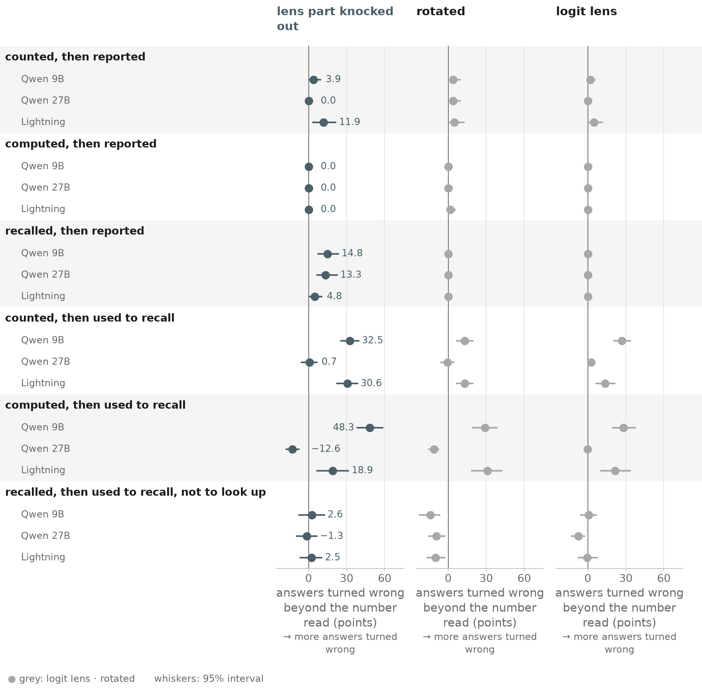

{{caption_short|breadth/readme/10b_beyond}}

- **Scope: what this says about H0.**
  - The lens part is needed where the last step recalls a fact about an entity, whatever the earlier steps were. It is not needed for a recall keyed by a number (a month or planet at a position).
  - Recalled intermediates followed by a read step drop little in Lightning; the 27B's M → M → P is the exception.
  - A number computed from the passage needs no lens part to be reported (all three models), nor, in the 27B, to key a recall. In the 9B and Lightning that last test cannot be read.
- **Confidence.** Not set by the authors for this claim.
- **Limits.** I have not tested, on v2, a bridge entity that the model computes rather than reads or recalls.

What the model says instead under the removal, in five classes of reply:

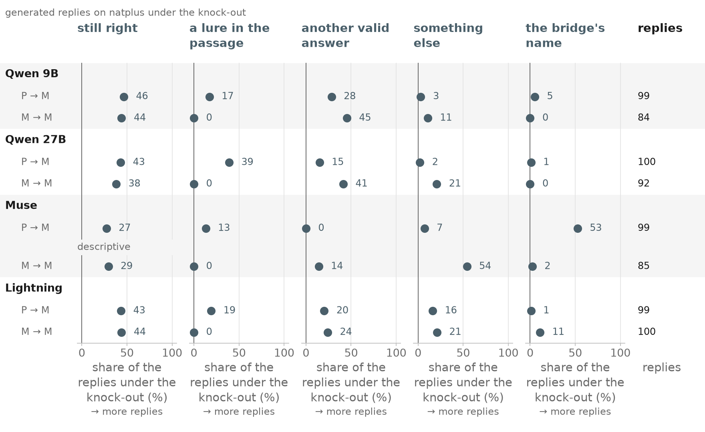

{{caption_short|breadth/readme/10c_beyond}}

## Part IV. What the need is

### Finding 7. What recall needs is the answer's own directions

On the twin set, keeping only the answer span's directions inside the removal undoes {{w|fig10.keep_span.nl}} to {{w|fig10.keep_span.q27}} of the recall's damage. Removing only them does all of it. A random keep of the same energy undoes {{w|fig10.keep_ctrl.q9}} to {{w|fig10.keep_ctrl.q27}} (9B, 27B). So the gap of [Finding 1](#finding-1-recall-needs-the-lens-part-reading-the-stated-fact-does-not) measures how much recall needs its answer word's directions, not whether the bridge is used as a step.

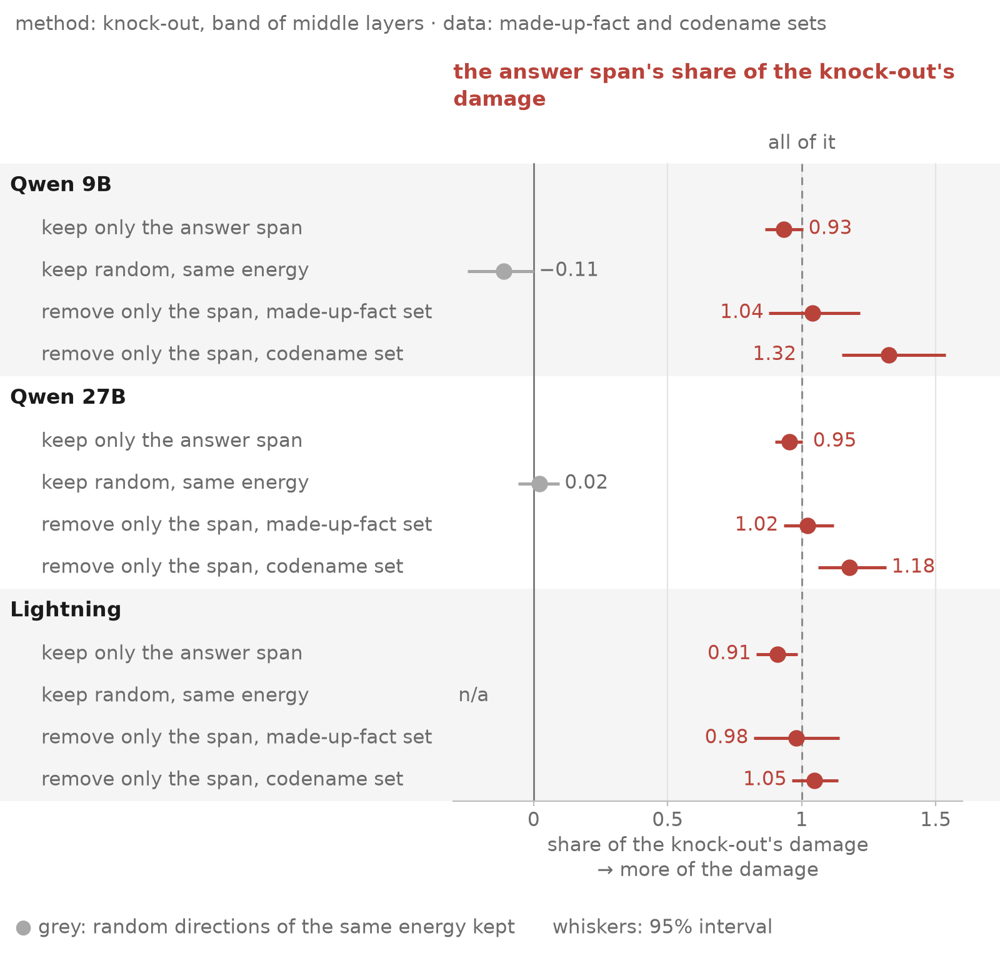

{{caption_short|common/writeup/10_answer_span}}

Test, results, controls and limits

- **Test.** On the twin set, remove the lens part over the band but keep the answer span's directions; and remove only the answer span, net of a random part of the same energy; also on the codename set. The answer-only removal fixed in advance (note 57); the keep is descriptive: a number under a label fixed in advance (note 41).
- **Result.**

  | | 9B | 27B | Lightning |
  |---|---|---|---|
  | keeping the answer span: share of the recall's damage undone | {{wci|fig10.keep_span.q9}} | {{wci|fig10.keep_span.q27}} | {{wci|fig10.keep_span.nl}} |
  | control: a random keep of the same energy, orthogonal to the answers | {{wci|fig10.keep_ctrl.q9}} | {{wci|fig10.keep_ctrl.q27}} | no random part matched in energy |
  | answer span alone: multiple of the full damage | {{wci|fig10.span_only.v4.q9}} | {{wci|fig10.span_only.v4.q27}} | {{wci|fig10.span_only.v4.nl}} |
  | the same, codename set | {{wci|fig10.span_only.codename.q9}} | {{wci|fig10.span_only.codename.q27}} | {{wci|fig10.span_only.codename.nl}} |

- **Controls.** Both random parts are matched on energy: the random keep to the answer span's keep, and the random part subtracted from the answer-only removal.
- **Scope.** The twin and codename sets, on the 9B, the 27B and Lightning.
- **Confidence.** Set by the authors in [docs/plans/credences.md](../plans/credences.md), rows `answer_directions` and `beyond_countries`.
- **Limits.** On Lightning the random part reached its target energy on only {{w|fig10.span_only_matched.v4.nl}} of the twin items and {{w|fig10.span_only_matched.codename.nl}} of the codename items. The twin and codename items are not posted; their numbers are.

### Finding 8. Removals orthogonal to the answer cost nothing, even for a one-hop question about the subject

On a one-hop question about a city, removing the city's lens directions costs the answer, and removing the answers' own directions costs more. The city's directions made orthogonal to the answers cost nothing (post hoc). A cleaned subspace built from the data stays under the bar fixed in advance, though not decisively on the 27B and Lightning. A removal that spares the answer's directions cannot show that an intermediate step is used.

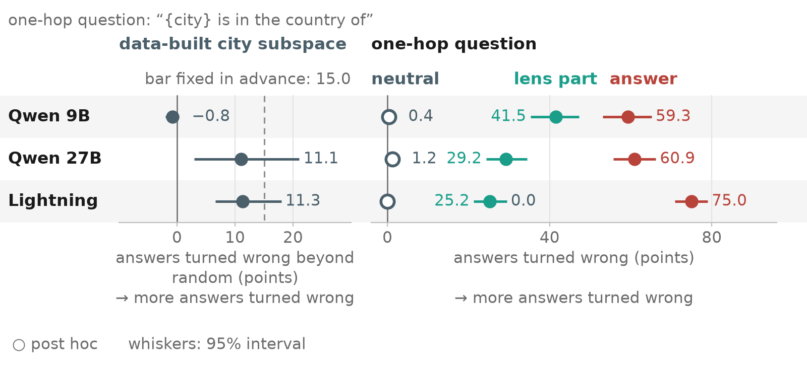

{{caption_short|common/writeup/11_orthogonal}}

Test, results, controls and limits

- **Test.** On a one-hop question about the subject (a city), remove its lens directions, the answers' own directions, or its directions made orthogonal to the answers. Remove a subspace built from the data, cleaned of the answers, against a random part of the same energy. The city and answer arms were fixed in advance; the orthogonal arm is post hoc on all three models; the data-built subspace fixed in advance (rule R1, bar 15 points)<!-- src: data/figures/writeup/data.csv | fig11.clean_subspace.q27 -->.
- **Result.** Points.

  | | 9B | 27B | Lightning |
  |---|---|---|---|
  | the city's lens directions | {{wci|fig11.onehop.city.q9}} | {{wci|fig11.onehop.city.q27}} | {{wci|fig11.onehop.city.nl}} |
  | the answers' own directions | {{wci|fig11.onehop.answers.q9}} | {{wci|fig11.onehop.answers.q27}} | {{wci|fig11.onehop.answers.nl}} |
  | the city's directions orthogonal to the answers (no interval) | {{w|fig11.onehop.city_perp.q9}} ○ | {{w|fig11.onehop.city_perp.q27}} ○ | {{w|fig11.onehop.city_perp.nl}} ○ |
  | cleaned subspace minus random | {{wci|fig11.clean_subspace.q9}} | {{wci|fig11.clean_subspace.q27}} | {{wci|fig11.clean_subspace.nl}} |

- **Controls.** The cleaned subspace is compared with a random part matched on energy. The rule fixed in advance: under 15 points beyond random means the subject is not seen<!-- src: data/figures/writeup/data.csv | fig11.clean_subspace.q27 -->.
- **Scope.** One relation, on the 9B, the 27B and Lightning.
- **Confidence.** Set by the authors in [docs/plans/credences.md](../plans/credences.md), row `orthogonal`.
- **Limits.** All three point estimates are under the bar; the 27B's and Lightning's intervals reach above it, so the test is not decisive on those two. The orthogonal arm has no interval. One relation; the one-hop set's items are not posted, its numbers are.

### Finding 9. In agents, picking and verifying cost far less than producing

Posed as agent tasks on one relation, the removal costs producing the answer {{w|figA1.produce.q9}} to {{w|figA1.produce.nl}} points beyond a rotated part. Picking or verifying costs far less; several cells are descriptive. The recall's need is a need to produce the remembered word; tasks that only check or choose among given words need it much less.

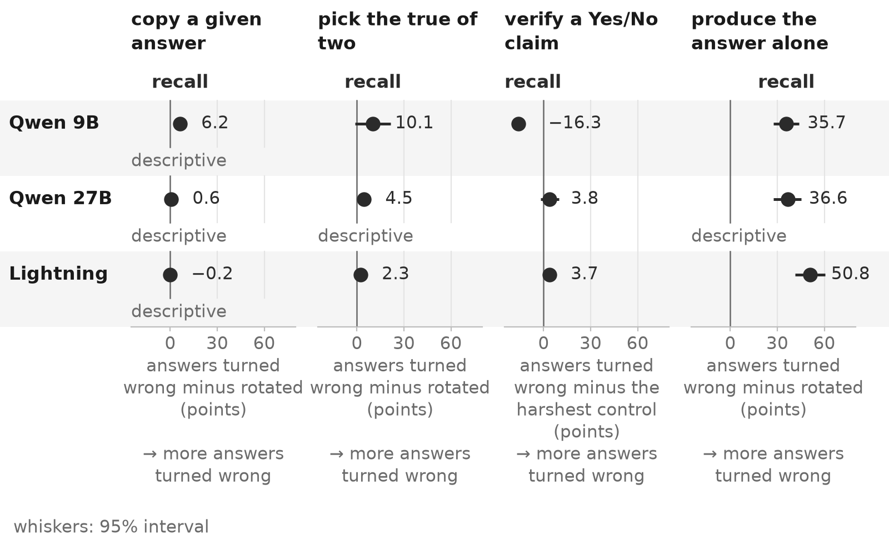

{{caption_short|common/writeup/a01_agents}}

Test, results, controls and limits

- **Test.** The facts of one relation posed as agent tasks: produce the answer, pick the true one of two, verify a claim, or copy a given answer, each under the removal.
- **Result.** Points beyond the control.

  | | 9B | 27B | Lightning |
  |---|---|---|---|
  | produce the answer | {{wci|figA1.produce.q9}} | {{wci|figA1.produce.q27}} | {{wci|figA1.produce.nl}} |
  | pick the true one of two | {{wci|figA1.pick.q9}} | {{wci|figA1.pick.q27}} | {{wci|figA1.pick.nl}} |
  | verify a claim | {{wci|figA1.verify.q9}} | {{wci|figA1.verify.q27}} | {{wci|figA1.verify.nl}} |
  | copy a given answer | {{wci|figA1.copy.q9}} | {{wci|figA1.copy.q27}} | {{wci|figA1.copy.nl}} |

- **Controls.** Producing, picking and copying are scored beyond a rotated part of the same size; verifying against the harshest control.
- **Scope.** One relation, on the 9B, the 27B and Lightning.
- **Confidence.** Set by the authors in [docs/plans/credences.md](../plans/credences.md), row `agents`.
- **Limits.** The roles fixed in advance differ by model and task (several cells descriptive); see the registry (data/figures/status.csv). The transcripts are not posted; their numbers are.

Every model, every test: nine models, and the untestable models

{{grid}}

Size-matched for Bolt: from the dose run (150 items per word), where no stand-alone run exists. Dose column: K\* as pre-registered (on the lens-specific excess). Bolt's readings stop at its specificity limit (K {{v|dose.nb.limit}}), so its K\* covers only 1-3 directions, where its effect is about 0.

Untestable: removing the top 10 lens directions adds more plain-text cross-entropy than the 2-nat bar:

| Model | Plain-text cross-entropy added |
|---|---|
| Gemma 4 31B-it | {{v|text.gemma}} |
| gpt-oss-20b | {{v|text.gptoss}} |
| Kolibri-1 | {{v|text.kol}} |

Three more models stopped on the earlier datasets, below the 30-point bar:

| Model | Earlier datasets |
|---|---|
| Qwen3-32B | {{v|old.q32.qwen3_32b_full2_ko_v1}} and {{v|old.q32.qwen3_32b_fresh2_ko_v1}} |
| Olmo-Hybrid 7B | {{v|old.oh7.olmoh7_big2_ko_v1}} |
| Olmo-3 7B | {{v|old.o7.olmo3d7_big2_ko_v1}} |

## What I predicted, and what happened

Each verdict links to its [hypotheses ledger](../plans/hypotheses.md) row, which names the deciding amendment.

- Recall steps need the J-space and lookups in the prompt do not → **[held](../plans/hypotheses.md#c1-memory-steps-need-the-j-space-prompt-lookups-dont-held-graded-across-models)**, graded across models.
- The need is only the bridge's own word → **[failed](../plans/hypotheses.md#h0-deflationary-failed-for-recalled-entities-held-in-part-for-computed-numbers)** for recalled entities, **held in part** for computed numbers.
- Any lookup in the chain keeps the bridge out of the J-space → **[failed](../plans/hypotheses.md#h3-any-retrieval-from-context-failed)**.
- The lens steers recall-used bridges, not lookup-used ones (the steering test) → **[withdrawn](../plans/hypotheses.md#c2-reading--using-the-lens-steers-recall-used-bridges-not-lookup-used-ones-withdrawn-24-oct)**, replaced by the swap.
- A stated or computed bridge is written only when a recall uses it → **[held in part](../plans/hypotheses.md#c2-a-stated-or-computed-bridge-is-written-only-when-a-recall-uses-it-held-in-part)**.
- Computed bridges sit in the J-space beyond their own word → **[not tested in the final design](../plans/hypotheses.md#c3-computed-bridges-sit-in-the-j-space-beyond-their-own-word-not-tested-in-the-final-design)**.
- The split holds on one Olmo 7B and fails on the other → **[failed](../plans/hypotheses.md#architecture-22-oct-c1-holds-on-olmo-hybrid-7b-and-fails-on-olmo-3-7b-failed)**.

Tests fixed in advance that failed, each with its number

- The 9B's second toy data seed: {{v|toy.q9.s2}}, below the 30-point bar; pooled over seeds it passed.
- The steering test (the plan's second claim, C2): most cells broke more than 10% of answers, and it was withdrawn on the 24 Oct re-score. The swap replaced it as the sufficiency test.
- The 27B with the plain J-lens: {{v|v1.q27.jlens}}, below 30.
- The never-named bridge, predicted to cost nothing extra: it costs the 27B {{v|r.q27}} and the 9B {{v|r.q9}}.
- The 122B by probability ({{v|ko.q122.soft}}). Muse's share with the logit lens. Bolt at 10 directions. OLMo.
- The 27B's P → P → M three-hop chain: {{vci|mod.q27.threehop.paper10.PPM-PPP}}, predicted to drop more than P → P → P.
- Lightning's numbers: counting costs {{v|mod.nl.numbers.paper10.KR-PR}} (predicted within 10), and reporting a recalled number {{v|mod.nl.numbers.paper10.MR-PR}} (predicted at least +10).
- The 9B's three-hop chains: unreadable, because the all-passage chain itself breaks.
- Numbers on the larger set (amendment 57):
  - The final-hop rule for numbers (amendment 24): fails for every start in all three models.
  - Lightning's v2 recall-keyed-by-a-recalled-number result ({{v|mod.nl.numbers.paper10.MM-ML}}, n {{n|mod.nl.numbers.paper10.loss.ML}}) did not replicate ({{v|mod2.nl.numbers.paper10.MM-ML}}).
  - H0 head-on: no reading in the 9B and Lightning (controls also cost computed chains more); in the 27B the computed chain drops {{a|mod2.q27.numbers.paper10.AM-PM}} less than a read one, outside the within-10 band.
  - Computation feeding a lookup within 10 of a read number (amendment 24): holds on the 9B ({{v|mod2.q9.numbers.paper10.KL-PL}}, {{v|mod2.q9.numbers.paper10.AL-PL}}), not on the 27B ({{v|mod2.q27.numbers.paper10.KL-PL}}, {{v|mod2.q27.numbers.paper10.AL-PL}}) or Lightning ({{v|mod2.nl.numbers.paper10.KL-PL}}, {{v|mod2.nl.numbers.paper10.AL-PL}}).
- Bolt's "distributed" reading (amendment 52, against the rotated control only) does not survive the size-matched control: at 100 directions the lens part costs {{v|dose.nb.k100}} and the same size along the top principal directions {{v|dose.nb.k100.pc}}.

## Where it does not hold

- **Across models the need is graded.** Strong and specific on three of nine; elsewhere weak, not specific, shared with the logit lens, gone by probability, or not needed ([the grid](#10-every-model-every-test)).
- **Three models cannot be tested.** The removal breaks plain text on Gemma 4 31B-it, gpt-oss-20b and Kolibri-1.
- **Longer chains.** Clean only on Lightning; the 27B's P → P → M drops only {{v|mod.q27.threehop.paper10.PPM-PPP}} points beyond the all-passage chain.
- **A computed number keying a recall.** Unreadable on the 9B and Lightning, because the controls also cost those chains more.
- **The setting.** Templated English passages, one band per model, greedy answers with thinking off.

Design errors and limits, each with its number

- **Design errors.**
  - **A fixed number of directions is not a fixed dose.** The top 10 remove 6% of the residual in Bolt and 13-20% elsewhere.
  - **The dose plateau rule (amendment 54) judged specificity by greedy answers**, which hide the stated facts' probability drop; note 1 adds the excess and probability readings.
  - **The dev depth profiles first covered countries only.** Redone on all relations, the bands held.
- **Limits.**
  - Templated passages over one fact set per dataset; English only.
  - One band per model.
  - Greedy answers with thinking off.
  - The Qwens use published J++ lenses; the Nemotrons, Ministral and Muse use the project's own fits (the same fit on the 9B gives the same effect; [Finding 2](#finding-2-the-split-is-not-one-dataset-relation-rendering-or-checkout)).
  - The removal also costs plain text: {{v|text.q27}} (27B) to {{v|text.nl}} (Lightning).
  - One bootstrap seed.
  - The 122B in FP8.
  - The dose and swap-dose runs use 150 random items per word.

## How I checked

- **Rules fixed in advance.** Breadth runs follow a [pre-registration](prereg_replication_1022.md) whose amendments were committed before each run; post hoc choices are marked ○.
- **Reruns.** A clean checkout reproduces the Qwens' removals row for row, and Lightning's headline ([Finding 2](#finding-2-the-split-is-not-one-dataset-relation-rendering-or-checkout)).
- **Recompute and hand-check.** The [verification kit](verify_kit.md), from my scripts/verify_kit.py, recomputes the headline gap from per-item rows and lists 20 random items per model. Dan's 46-item hand-check changed no headline claim ([findings](../review/handcheck_findings.md))<!-- src: docs/review/handcheck_findings.md | 46 items across views a-g -->. No human recomputation is in [VERIFIED.md](../../VERIFIED.md) yet.

Run provenance

- **Clean-checkout reruns**: row-identical for the 27B and 9B. Lightning reproduces its headline, not row for row; a determinism check traces that to its inputs, not its kernels ([Finding 2](#finding-2-the-split-is-not-one-dataset-relation-rendering-or-checkout)). Amendment 57's results reran from a clean checkout identical in {{v|clean57.same}} of {{v|clean57.n}} comparisons ({{v|clean57.rows}} rows and items; every read and log-probability equal), Lightning's late band included.
- **Run log.** docs/archive/EXPERIMENTS.md has one line per run, with its W&B link.

## Related work and what is new

- **Not new.** Removing the top lens directions hurts free-form recall and multi-step reasoning, and spares extraction and multiple choice (Gurnee et al. 2026, Figure 24<!-- src: docs/shared/references.md | Gurnee et al. 2026; Figure 24 -->). Subjects are enriched with their attributes (Geva et al. 2023<!-- src: docs/shared/references.md | Geva, Bastings, Filippova and Globerson 2023 -->).
- **New here.** Matched recall and lookup items across nine models, each removal against three same-size controls.
- **Methods I build on.** In the root README's [Related work](../../README.md#related-work-and-what-is-new) and the [references](../shared/references.md).

## Open questions

- **Is OLMo weak, or under-dosed?** Next: OLMo through the dose grid, as Muse's ran (amendment 57 notes 1 and 5).
- **Does a bridge computed from the passage need the lens part?** Computed numbers do not; a computed entity is untested on v2. Next: the [H0](../plans/hypotheses.md#h0-deflationary-failed-for-recalled-entities-held-in-part-for-computed-numbers) head-on test with such a bridge.

## Reproduce

See the root README's [Reproduce](../../README.md#reproduce).

## Repository guide

- **This report doubles as the breadth track's ledger.** Every number is in [data.csv](data.csv) with its source file; the run log is [docs/archive/EXPERIMENTS.md](../archive/EXPERIMENTS.md).
- **Builders.** scripts/report_breadth.py builds data.csv and this page, last at {{head}}; src/bridge_jspace/figkit/breadth_sp.py draws [the figures](../../figures/breadth/).
- **Licences and citing.** Code is [MIT](../../LICENSE); each data file keeps its source's terms ([data/SOURCES.md](../../data/SOURCES.md)). Cite with [CITATION.cff](../../CITATION.cff).

Sources, builders and figures

Every number on this page comes from [docs/breadth/data.csv](data.csv), each row with its source file, except the answer-span, orthogonal and agents numbers (Findings 7-9), which come from data/figures/writeup/data.csv with a source comment each; scripts/report_breadth.py builds it and this page (`--render` from the data files alone). The figures ([figures/breadth/](../../figures/breadth/)) are drawn from the same data by src/bridge_jspace/figkit/breadth_sp.py on styles-plot; their captions are in figures/breadth/readme/_meta/captions.toml.

